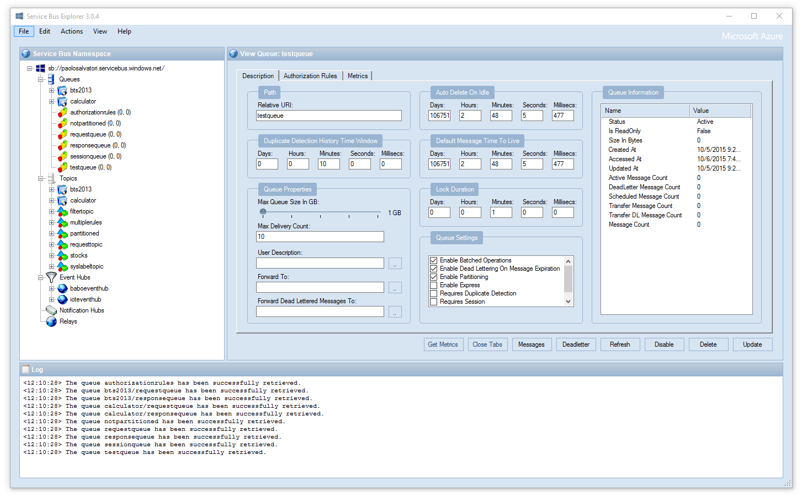

[](https://ci.appveyor.com/project/seanfeldman/servicebusexplorer/branch/master)

**Author:** Paolo Salvatori ([@babosbird](https://twitter.com/babosbird))  
**Collaborators:**  Sean Feldman ([@sfeldman](https://twitter.com/sfeldman)) and Erik Mogensen  
**Contributors:** [Many](https://github.com/paolosalvatori/ServiceBusExplorer/graphs/contributors)

# Service Bus Explorer
The Service Bus Explorer allows users to connect to a Service Bus namespace and efficiently administer messaging entities. The tool provides advanced features like import/export functionality or the ability to test topic, queues, subscriptions, relay services, notification hubs and events hubs.

There are no dedicated developers so development is entirely based on voluntary effort.



# Installation
## Using [Chocolatey](https://chocolatey.org/install)
```
choco install ServiceBusExplorer
```

More information on our [Chocolatey page](https://chocolatey.org/packages/ServiceBusExplorer).

## Using GitHub
```
curl -s https://api.github.com/repos/paolosalvatori/ServiceBusExplorer/releases/latest | grep browser_download_url | cut -d '"' -f 4
```

# Contributions
Here are some guidelines concerning contributions:

- All contributions should be done on `develop`
	- `master` is only for releases
- Every pull request is built by AppVeyor and should preferably be linked to a GitHub issue.
- Write unit tests, if applicable
- We have started to migrate from the old SDK to the latest SDKs for Service Bus, Event Hubs, Relay and Notification Hubs. Therefore, new classes should not depend on the old SDK unless absolutely necessary.  


# Development Environment

Visual Studio 2019 16.8.0 or later is required to build the solution. 

When editing UI elements Visual Studio should run as a DPI-unaware process. For more information about this, see the [Visual Studio documentation](https://docs.microsoft.com/en-us/dotnet/framework/winforms/disable-dpi-awareness-visual-studio). In Visual Studio 2017 15.9.12 the informational bar looks like this  when it is running as a DPI-unaware process.


# Azure Service Bus
Microsoft Azure Service Bus is a reliable information delivery service. The purpose of this service is to make communication easier. When two or more parties want to exchange information, they need a communication facilitator. Service Bus is a brokered, or third-party communication mechanism. This is similar to a postal service in the physical world. Postal services make it very easy to send different kinds of letters and packages with a variety of delivery guarantees, anywhere in the world.

Similar to the postal service delivering letters, Service Bus is flexible information delivery from both the sender and the recipient. The messaging service ensures that the information is delivered even if the two parties are never both online at the same time, or if they aren't available at the exact same time. In this way, messaging is similar to sending a letter, while non-brokered communication is similar to placing a phone call (or how a phone call used to be - before call waiting and caller ID, which are much more like brokered messaging).

The message sender can also require a variety of delivery characteristics including transactions, duplicate detection, time-based expiration, and batching. These patterns have postal analogies as well: repeat delivery, required signature, address change, or recall.

Service Bus supports two distinct messaging patterns: Azure Relay and Service Bus Messaging.

For more information, feel free to read the official documentation [here](https://docs.microsoft.com/en-us/azure/service-bus-messaging/service-bus-messaging-overview).

# Service Bus Explorer for Windows Server
The Service Bus Explorer 2.1.0 can be used with the Service Bus for Windows Server 1.1. The Service Bus Explorer 2.1.0 uses a version of the [Microsoft.ServiceBus.dll](http://www.nuget.org/packages/WindowsAzure.ServiceBus/) client library which is compatible with the Service Bus for Windows Server 1.1 RTM version. You can download the source code of the Service Bus Explorer 2.1.0 [here](https://github.com/paolosalvatori/ServiceBusExplorer/releases/tag/2.1.0).

# Documentation
[Here](./docs/documentation.md) you can find the tool documentation and a log of the features implemented over time.

# GitHub
The source code of the tool is now available on [GitHub](https://github.com/paolosalvatori/ServiceBusExplorer) as a public project. Now you have the opportunity to contribute to the evolution of the tool!

<a href="https://github.com/paolosalvatori/ServiceBusExplorer/releases" ></a>

# Videos
For more information on how to use the Service Bus Explorer, see the following videos on Channel9:

- [Getting Started with Service Bus. Part 3: Service Bus Explorer](http://www.digitalpodcast.com/items/10765228) by Clemens Vasters
- [Cross Platform Notifications using Windows Azure Notifications Hub](http://channel9.msdn.com/Shows/Cloud+Cover/Episode-116-Cross-Platform-Notifications-using-Windows-Azure-Notifications-Hub) by Elio Damaggio, Nick Harris and Chris Risner.

# Alternative Service Bus Management Tools
Service Bus Explorer is only one of the management tools available for Azure Service Bus.

Here are a couple of alternatives:

- **Microsoft Azure Management Portal** _(SaaS, web based, extremely basic)_
- **Serverless360** _(paid with free trial, SaaS, web based)_
- **PowerShell** _([Documentation](https://docs.microsoft.com/en-us/azure/service-bus-messaging/service-bus-manage-with-ps))_

# License
Microsoft Corporation ("Microsoft") grants you a nonexclusive, perpetual, royalty-free right to use and modify the software code provided by us for the purposes of illustration ("Sample Code") and to reproduce and distribute the object code form of the Sample Code, provided that you agree: (i) to not use our name, logo, or trademarks to market your software product in which the Sample Code is embedded; (ii) to include a valid copyright notice on your software product in which the Sample  Code is embedded; and (iii) to indemnify, hold harmless, and defend us and our suppliers from and against any claims or lawsuits, whether in an action of contract, tort or otherwise, including attorneys' fees, that arise or result from the use or distribution  of the Sample Code or the use or other dealings in the Sample Code. Unless applicable law gives you more rights, Microsoft reserves all other rights not expressly granted herein, whether by implication, estoppel or otherwise.

THE SAMPLE CODE IS PROVIDED "AS IS", WITHOUT WARRANTY OF ANY KIND, EXPRESS OR IMPLIED, INCLUDING BUT NOT LIMITED TO THE WARRANTIES OF MERCHANTABILITY, FITNESS FOR A PARTICULAR PURPOSE AND NONINFRINGEMENT. IN NO EVENT SHALL MICROSOFT OR ITS LICENSORS BE LIABLE  FOR ANY DIRECT, INDIRECT, INCIDENTAL, SPECIAL, EXEMPLARY, OR CONSEQUENTIAL DAMAGES (INCLUDING, BUT NOT LIMITED TO, PROCUREMENT OF SUBSTITUTE GOODS OR SERVICES; LOSS OF USE, DATA, OR PROFITS; OR BUSINESS INTERRUPTION) HOWEVER CAUSED AND ON ANY THEORY OF LIABILITY,  WHETHER IN CONTRACT, STRICT LIABILITY, OR TORT (INCLUDING NEGLIGENCE OR OTHERWISE) ARISING IN ANY WAY OUT OF THE USE OF THE SAMPLE CODE, EVEN IF ADVISED OF THE POSSIBILITY OF SUCH DAMAGE.
