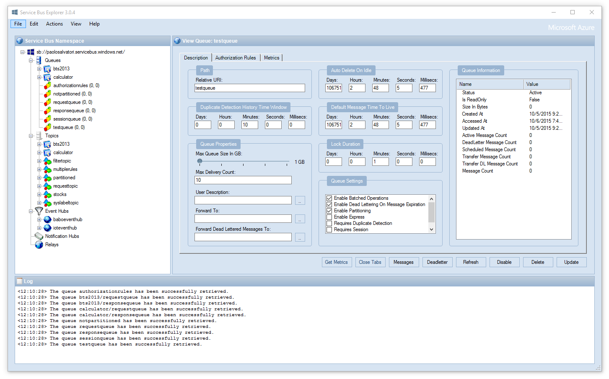
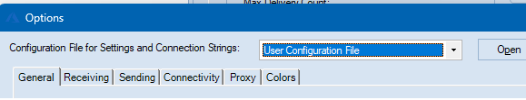
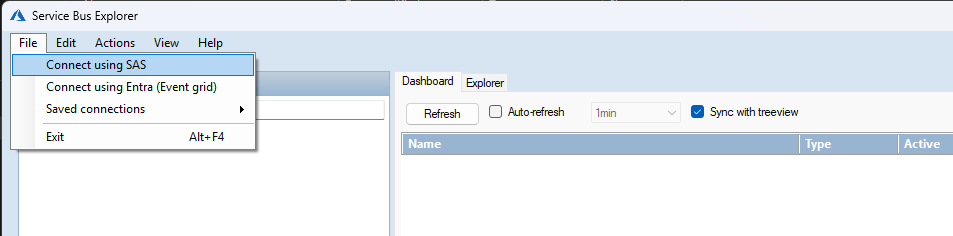
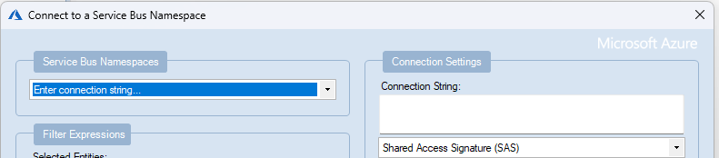
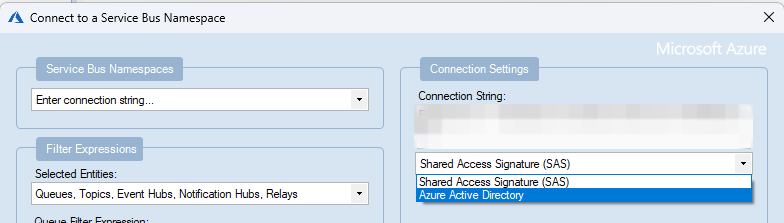
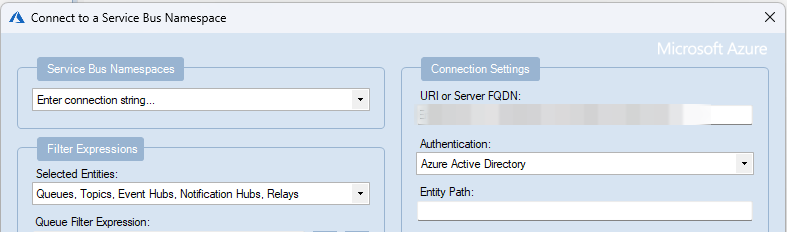
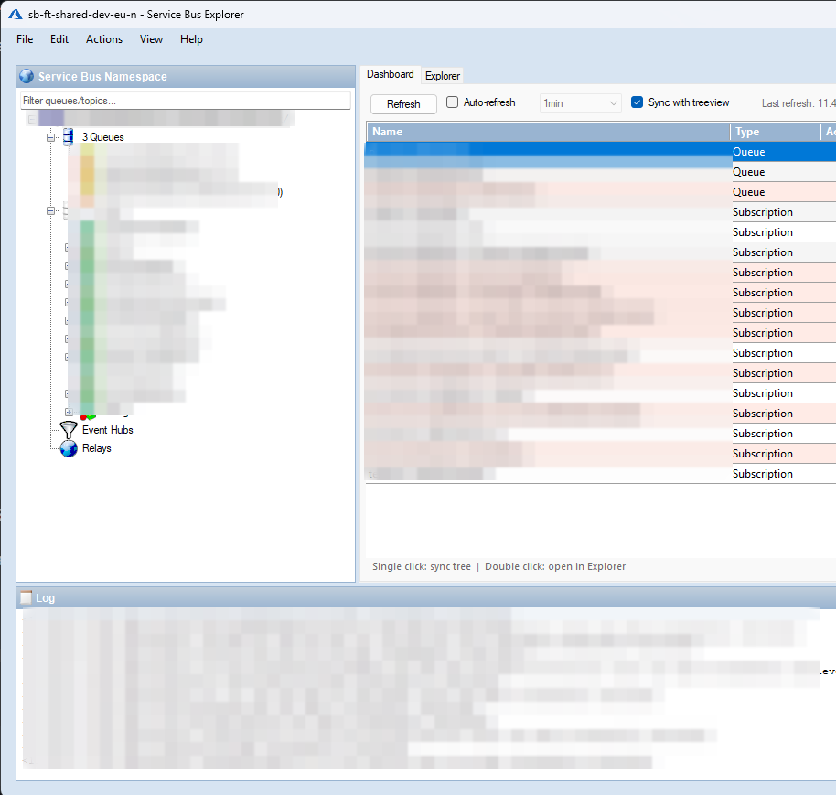

**Author:** Paolo Salvatori ([@babosbird](https://twitter.com/babosbird))  
**Collaborators:**  Sean Feldman ([@sfeldman](https://twitter.com/sfeldman)) and Erik Mogensen ([@koltrast](https://twitter.com/koltrast))  
**Contributors:** [Many](https://github.com/paolosalvatori/ServiceBusExplorer/graphs/contributors)

# Service Bus Explorer
The Service Bus Explorer allows users to efficiently administer messaging entities. The tool provides advanced features like import/export functionality and the ability to test topic, queues, subscriptions, relay services, notification hubs and events hubs.

## Features

- **Dashboard tab** — live overview of message counts (Active, Dead Letter, Scheduled, Total) for all queues and subscriptions, with auto-refresh and color-coded dead-letter alerts
- **TreeView search/filter** — real-time filtering of queues, topics and subscriptions; press Ctrl+F to focus
- **Copy message body** — one-click clipboard copy from the message preview pane
- **Microsoft Entra ID sign-in** — interactive browser authentication for Azure Service Bus namespaces without storing SAS secrets locally
- Import/export of namespace configuration
- Send, receive and peek messages for queues, topics and subscriptions
- Dead-letter message management
- Relay services, Notification Hubs and Event Hubs support



# Software requirements
The following software is required to run ServiceBusExplorer. It may run on other versions.

- Windows 10 or later
- .NET Framework 4.6.2

# Installation

It is strongly recommended to set `Configuration File for Settings and Connection Strings` to `User Configuration File` as shown in the figure below to reduce problems when upgrading. 


> **_Note:_** The `ServiceBusExplorer.exe.config` in the application directory will get overwritten during the upgrade.
>
> If you have made changes to it, you should back it up before upgrading. If you follow the recommendation above then only advanced changes such as WCF configuration modifications cause this. 
>
> Do not overwite the new configuration file with the old file since the `runtime` section in the new must file not be modified. 

## Using [Chocolatey](https://chocolatey.org/install)

### Installing for the first time

```
choco install ServiceBusExplorer
```

### Upgrading

```
choco upgrade ServiceBusExplorer
```

The default location of the executable is `C:\ProgramData\chocolatey\lib\ServiceBusExplorer\tools\ServiceBusExplorer.exe`.

More information on our [Chocolatey page](https://chocolatey.org/packages/ServiceBusExplorer).

## Using [Scoop](https://scoop.sh)

> **__Warning_** The `scoop` package is not maintained by the ServiceBusExplorer project so carefully check the package and the URLs it uses before using it. Also, the current package keeps the old version of `ServiceBusExplorer.exe.config`. That may cause assembly loading issues so do not use it for upgrading.

```
scoop install extras/servicebusexplorer
```

The default location of the executable is `%USERPROFILE%\scoop\apps\servicebusexplorer\current\tools\ServiceBusExplorer.exe`.

## Using GitHub
```
curl -s https://api.github.com/repos/paolosalvatori/ServiceBusExplorer/releases/latest | grep browser_download_url | cut -d '"' -f 4
```

## Using [Winget](https://learn.microsoft.com/en-us/windows/package-manager/winget/)

````
winget install --id paolosalvatori.ServiceBusExplorer --source winget
````

## Microsoft Entra ID / Azure AD sign-in

Service Bus Explorer supports interactive browser sign-in for Azure Service Bus namespaces on the **public Azure cloud**. Sovereign clouds (Azure Government, Azure China, etc.) are not currently supported.

### How to connect

1. Open the regular Service Bus connection dialog.
2. Select `Select a service bus namespace...` for a manual connection, or edit an existing saved connection.
3. Change `Authentication` to `Azure Active Directory`.
4. Enter the namespace endpoint as either `sb://<namespace>.servicebus.windows.net/` or `<namespace>.servicebus.windows.net`.
5. Optionally enter `Tenant ID` and `Entity Path`. If `Tenant ID` is left blank, Service Bus Explorer uses the `organizations` endpoint, so the sign-in flow accepts work or school accounts only.
6. Click `OK` and complete the browser sign-in flow.

> **Note**
>
> The `File -> Connect using Entra (Event grid)` menu entry is for Event Grid, not Azure Service Bus. For Service Bus, use the normal connection dialog and switch the `Authentication` selector to `Azure Active Directory`.
>
> Personal Microsoft accounts are not supported for Service Bus authentication unless they have been invited into a Microsoft Entra tenant that has access to the namespace.

### Screenshots

Use the regular Service Bus connection flow, not the Event Grid-specific menu entry:



Open the normal connection dialog:



Switch `Authentication` to `Azure Active Directory`:



Enter the namespace endpoint and optional Entra metadata:



After sign-in, the namespace can be browsed without storing SAS keys locally:



### Saved connection string format

Saved Entra-based connections use the following format:

```text
Endpoint=sb://<namespace>.servicebus.windows.net/;AuthMode=AAD;TenantId=<tenant-id>;TransportType=Amqp;EntityPath=<entity-path>
```

Minimal example:

```text
Endpoint=sb://<namespace>.servicebus.windows.net/;AuthMode=AAD
```

### Current scope

- Interactive browser sign-in only
- Azure Active Directory mode currently loads Service Bus queues, topics, and subscriptions only
- Event Hubs, Notification Hubs, and Relay are not loaded when Azure Active Directory authentication is selected
- Local persistence stores metadata only, not passwords or SAS keys
- Managed identity, Azure CLI auth and service principal auth are not included in this feature

# Contributions
There are no dedicated developers so development is entirely based on voluntary effort.

Here are some guidelines concerning contributions:

- All contributions should be done on `main`.
- Every pull request is built by GitHub Actions and should preferably be linked to a GitHub issue.
- Write unit tests, if applicable.
- We have started to migrate from the old SDK to the latest SDKs for Service Bus, Event Hubs, Relay and Notification Hubs. Therefore, new classes should not depend on the old SDK unless absolutely necessary.  


## Development Environment

Visual Studio 2022 17.8.0 or later is required to build the solution. 

When editing UI elements Visual Studio should run as a DPI-unaware process. For more information about this, see the [Visual Studio documentation](https://docs.microsoft.com/en-us/dotnet/framework/winforms/disable-dpi-awareness-visual-studio). In Visual Studio 2022 the informational bar looks like this  when it is running as a DPI-unaware process.


# Azure Service Bus
Microsoft Azure Service Bus is a reliable information delivery service. The purpose of this service is to make communication easier. When two or more parties want to exchange information, they need a communication facilitator. Service Bus is a brokered, or third-party communication mechanism. This is similar to a postal service in the physical world. Postal services make it very easy to send different kinds of letters and packages with a variety of delivery guarantees, anywhere in the world.

Similar to the postal service delivering letters, Service Bus is flexible information delivery from both the sender and the recipient. The messaging service ensures that the information is delivered even if the two parties are never both online at the same time, or if they aren't available at the exact same time. In this way, messaging is similar to sending a letter, while non-brokered communication is similar to placing a phone call (or how a phone call used to be - before call waiting and caller ID, which are much more like brokered messaging).

The message sender can also require a variety of delivery characteristics including transactions, duplicate detection, time-based expiration, and batching. These patterns have postal analogies as well: repeat delivery, required signature, address change, or recall.

For more information, feel free to read the official documentation [here](https://docs.microsoft.com/en-us/azure/service-bus-messaging/service-bus-messaging-overview).

# Service Bus Explorer for Windows Server
The Service Bus Explorer 2.1.0 can be used with the Service Bus for Windows Server 1.1. The Service Bus Explorer 2.1.0 uses a version of the [Microsoft.ServiceBus.dll](http://www.nuget.org/packages/WindowsAzure.ServiceBus/) client library which is compatible with the Service Bus for Windows Server 1.1 RTM version. You can download the source code of the Service Bus Explorer 2.1.0 [here](https://github.com/paolosalvatori/ServiceBusExplorer/releases/tag/2.1.0).

# Documentation
[Here](./docs/documentation.md) you can find the tool documentation and a log of the features implemented over time.

# Alternative Service Bus Management Tools
Service Bus Explorer is only one of the management tools available for Azure Service Bus.

Here are a couple of alternatives. We do not take responsibility for them though:

| Tool                                     | Description                                   |
| ---------------------------------------- | --------------------------------------------- |
| Microsoft Azure Management Portal        | SaaS, web based, extremely basic              |
| Serverless360                            | paid with free trial, SaaS, web based         |
| [PowerShell]                             | free, open source, cross platform             |
| [Purple Explorer] (active fork)          | free, open source, cross platform             |
| [Superbus]                               | paid with a free trial, macOS                 |
| [Service Bus Cloud Explorer]             | paid with a free basic plan, SaaS, web based  |
| [Service Bus TUI](https://github.com/MonsieurTib/service-bus-tui) | free, open source, cross platform, terminal based             |

[PowerShell]: https://docs.microsoft.com/en-us/azure/service-bus-messaging/service-bus-manage-with-ps
[Purple Explorer]: https://github.com/philipmat/PurpleExplorer
[Superbus]: https://superbus.app/
[Service Bus Cloud Explorer]: https://cloudbricks.io/products/service_bus_cloud_explorer/
